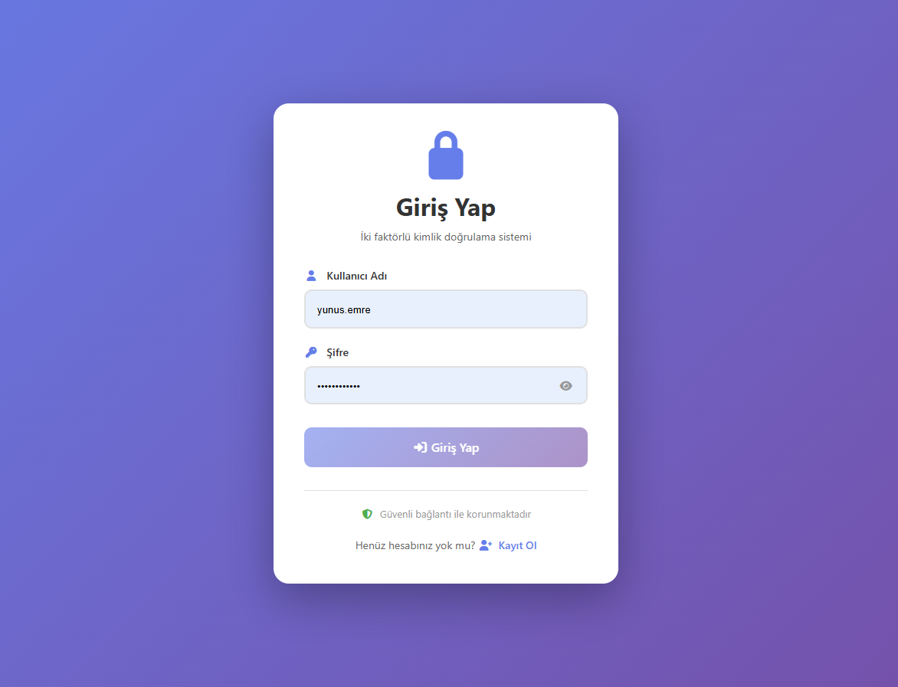
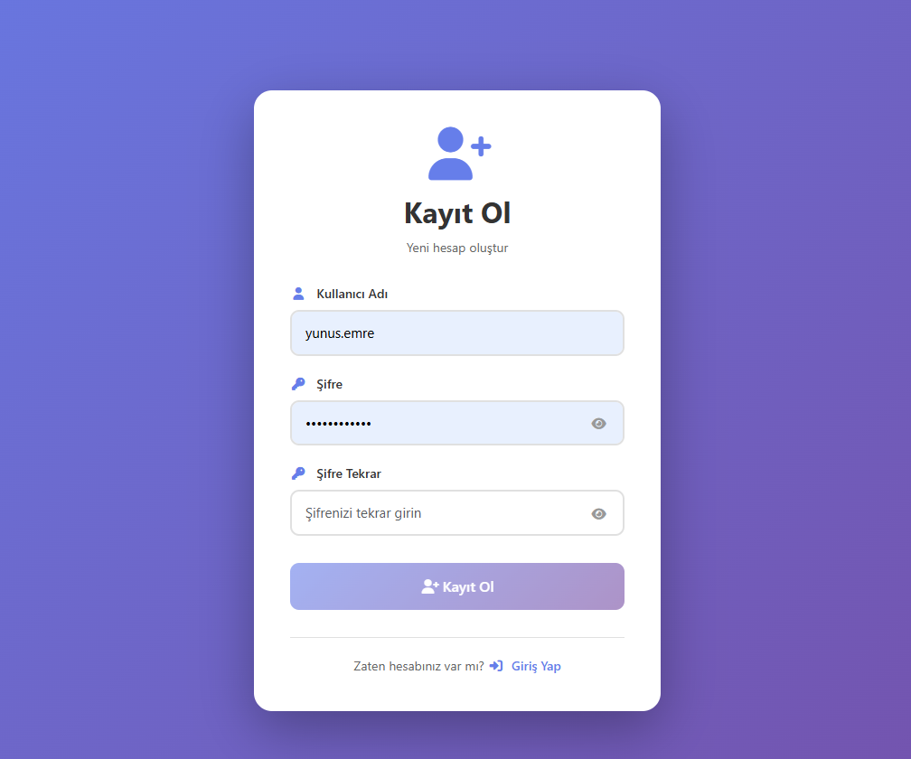
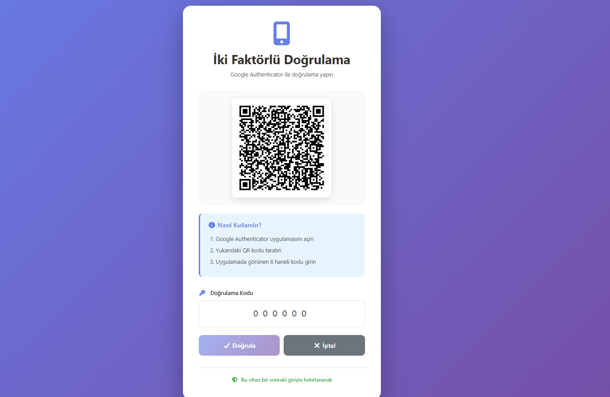
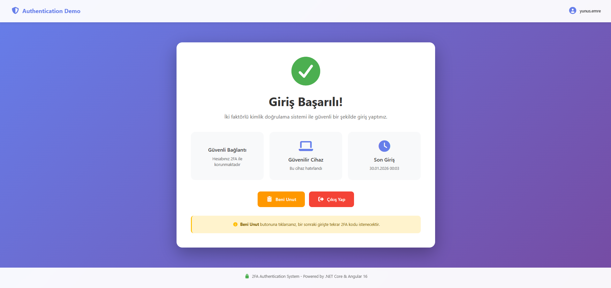

# Two-Factor Authentication System

İki faktörlü kimlik doğrulama (2FA) sistemi. Google Authenticator ile TOTP doğrulaması yapılır.

## 🎯 Özellikler

✅ Kullanıcı kayıt ve giriş  
✅ Google Authenticator ile 2FA  
✅ Güvenilir cihaz hatırlama  
✅ "Beni Unut" özelliği  
✅ JWT token tabanlı authentication  
✅ Aynı PC'den farklı kullanıcılar giriş yapabilir  
✅ Responsive tasarım  

## 🛠️ Teknolojiler

- **Backend:** .NET Core 8 Web API
- **Frontend:** Angular 16
- **Database:** Microsoft SQL Server
- **Authentication:** JWT + Google Authenticator (TOTP)
- **ORM:** Entity Framework Core
- **UI Framework:** Bootstrap 5

## 📦 NuGet Paketleri

- Microsoft.EntityFrameworkCore.SqlServer
- Microsoft.AspNetCore.Authentication.JwtBearer
- BCrypt.Net-Next
- OtpNet
- QRCoder

## 📸 Ekran Görüntüleri

### Giriş Ekranı


### Kayıt Ekranı


### 2FA Doğrulama


### Ana Sayfa


## 🚀 Kurulum

### Gereksinimler

- .NET 8.0 SDK
- Node.js (v16+)
- SQL Server 2019+
- Visual Studio 2022 veya VS Code
- Google Authenticator uygulaması (mobil)

### Backend Kurulumu

1. **Repository'yi klonla:**
```bash
   git clone https://github.com/yesenturk/authentication-demo-2fa.git
   cd authentication-demo-2fa
```

2. **SQL Server'da database oluştur:**
```sql
   CREATE DATABASE AuthenticationDemo;
```

3. **Connection string'i ayarla:**
   
   `appsettings.Development.json` dosyası oluştur:
```json
   {
     "ConnectionStrings": {
       "DefaultConnection": "Server=localhost;Database=AuthenticationDemo;Trusted_Connection=True;TrustServerCertificate=True;"
     },
     "JwtSettings": {
       "SecretKey": "YOUR_SECRET_KEY_HERE_MIN_32_CHARS",
       "Issuer": "AuthenticationDemo",
       "Audience": "AuthenticationDemoUsers",
       "ExpiryMinutes": 60
     }
   }
```

4. **Migration uygula:**
```bash
   cd AuthenticationDemo.API
   dotnet ef database update
```

5. **Projeyi çalıştır:**
```bash
   dotnet run
```
   
   API: `http://localhost:5141`  
   Swagger: `http://localhost:5141/swagger`

### Frontend Kurulumu

1. **Frontend klasörüne git:**
```bash
   cd frontend/authentication-demo-ui
```

2. **Paketleri yükle:**
```bash
   npm install
```

3. **Backend URL'ini kontrol et:**
   
   `src/environments/environment.ts` dosyasını aç:
```typescript
   export const environment = {
     production: false,
     apiUrl: 'http://localhost:5141/api'
   };
```

4. **Uygulamayı başlat:**
```bash
   ng serve
```
   
   Angular: `http://localhost:4200`

## 📱 Kullanım

### 1. Yeni Kullanıcı Oluşturma

1. `http://localhost:4200` adresine git
2. **"Kayıt Ol"** linkine tıkla
3. Kullanıcı adı ve şifre belirle
4. **"Kayıt Ol"** butonuna tıkla

### 2. İlk Giriş (2FA Kurulumu)

1. Kullanıcı adı ve şifreni gir
2. QR kod ekranı açılacak
3. Mobil cihazında **Google Authenticator** uygulamasını aç
4. **"+"** butonuna tıkla → **"Scan a QR code"** seç
5. Ekrandaki QR kodu tarat
6. Google Authenticator'da görünen **6 haneli kodu** gir
7. Giriş başarılı! Cihaz otomatik olarak güvenilir cihaz olarak kaydedildi

### 3. Sonraki Girişler (Güvenilir Cihaz)

1. Aynı bilgisayardan giriş yaptığında
2. Sadece kullanıcı adı ve şifre yeterli
3. 2FA kodu **sorulmaz** (güvenilir cihaz)

### 4. Cihazı Unutturma

1. Ana sayfada **"Beni Unut"** butonuna tıkla
2. Onayla
3. Bir sonraki girişte tekrar 2FA kodu istenecek

## 🗄️ Database Şeması

### Users Tablosu
| Kolon | Tip | Açıklama |
|-------|-----|----------|
| Id | INT | Primary key |
| Username | NVARCHAR(100) | Kullanıcı adı (unique) |
| PasswordHash | NVARCHAR(500) | BCrypt hash |
| TotpSecret | NVARCHAR(200) | Google Authenticator secret |
| IsActive | BIT | Aktif mi? |
| CreatedDate | DATETIME2 | Oluşturulma tarihi |
| LastLoginDate | DATETIME2 | Son giriş |

### TrustedDevices Tablosu
| Kolon | Tip | Açıklama |
|-------|-----|----------|
| Id | INT | Primary key |
| UserId | INT | Foreign key (Users) |
| DeviceToken | NVARCHAR(500) | Unique cihaz tokeni |
| DeviceName | NVARCHAR(200) | Cihaz adı |
| IpAddress | NVARCHAR(50) | IP adresi |
| IsActive | BIT | Aktif mi? |
| CreatedDate | DATETIME2 | Oluşturulma |
| LastUsedDate | DATETIME2 | Son kullanım |

**Not:** DeviceToken + UserId kombinasyonu unique'dir (aynı PC'den farklı kullanıcılar giriş yapabilir)

## 🔒 Güvenlik Özellikleri

- ✅ Şifreler BCrypt ile hashlenir
- ✅ JWT token ile stateless authentication
- ✅ TOTP (Time-based One-Time Password) ile 2FA
- ✅ Device fingerprinting ile güvenilir cihaz takibi
- ✅ CORS koruması
- ✅ SQL Injection koruması (Entity Framework)
- ✅ XSS koruması (Angular sanitization)

## 🧪 Test

### Swagger ile Test

1. `http://localhost:5141/swagger` adresine git
2. `/api/auth/register` endpoint'ini kullan
3. Kullanıcı oluştur ve diğer endpoint'leri test et

### Manuel Test Senaryoları

**Senaryo 1: Yeni kullanıcı kaydı ve giriş**
- ✅ Kayıt başarılı
- ✅ QR kod gösteriliyor
- ✅ 2FA doğrulama çalışıyor
- ✅ Giriş başarılı

**Senaryo 2: Güvenilir cihaz**
- ✅ İkinci girişte 2FA atlanıyor
- ✅ Token database'e kaydediliyor

**Senaryo 3: Çoklu kullanıcı**
- ✅ Aynı PC'den farklı kullanıcılar giriş yapabiliyor
- ✅ Her kullanıcının ayrı device kaydı var

**Senaryo 4: Beni unut**
- ✅ Cihaz başarıyla unutuluyor
- ✅ Sonraki girişte 2FA soruluyor

## 🐛 Bilinen Sorunlar

- ~~Aynı PC'den farklı kullanıcılar giriş yapamıyordu~~ ✅ **Düzeltildi**

## 📝 TODO

- [ ] Ekran görüntüleri ekle
- [ ] Unit testler yaz
- [ ] Docker support ekle
- [ ] Email verification ekle
- [ ] "Şifremi Unuttum" özelliği
- [ ] Kullanıcı profil sayfası
- [ ] Admin paneli
- [ ] Aktif cihazları listeleme

## 🤝 Katkıda Bulunma

1. Bu repository'yi fork'la
2. Feature branch oluştur (`git checkout -b feature/amazing-feature`)
3. Değişikliklerini commit et (`git commit -m 'Add some amazing feature'`)
4. Branch'ini push'la (`git push origin feature/amazing-feature`)
5. Pull Request oluştur

## 📄 Lisans

Bu proje MIT lisansı altında lisanslanmıştır. Detaylar için [LICENSE](LICENSE) dosyasına bakın.

## 👨‍💻 Geliştirici

**Yunus Emre Şentürk**  
GitHub: [@yesenturk](https://github.com/yesenturk)

---


```
MIT License

Copyright (c) 2025 Yunus Emre Şentürk

Permission is hereby granted, free of charge, to any person obtaining a copy
of this software and associated documentation files (the "Software"), to deal
in the Software without restriction, including without limitation the rights
to use, copy, modify, merge, publish, distribute, sublicense, and/or sell
copies of the Software, and to permit persons to whom the Software is
furnished to do so, subject to the following conditions:

The above copyright notice and this permission notice shall be included in all
copies or substantial portions of the Software.

THE SOFTWARE IS PROVIDED "AS IS", WITHOUT WARRANTY OF ANY KIND, EXPRESS OR
IMPLIED, INCLUDING BUT NOT LIMITED TO THE WARRANTIES OF MERCHANTABILITY,
FITNESS FOR A PARTICULAR PURPOSE AND NONINFRINGEMENT. IN NO EVENT SHALL THE
AUTHORS OR COPYRIGHT HOLDERS BE LIABLE FOR ANY CLAIM, DAMAGES OR OTHER
LIABILITY, WHETHER IN AN ACTION OF CONTRACT, TORT OR OTHERWISE, ARISING FROM,
OUT OF OR IN CONNECTION WITH THE SOFTWARE OR THE USE OR OTHER DEALINGS IN THE
SOFTWARE.
```

---

### **3. Ekran Görüntüleri Klasörü**

Repository'nin kök dizininde `screenshots` klasörü oluştur ve ekran görüntülerini buraya koy:
```
authentication-demo-2fa/
├── screenshots/
│   ├── login.png
│   ├── register.png
│   ├── 2fa.png
│   └── home.png
